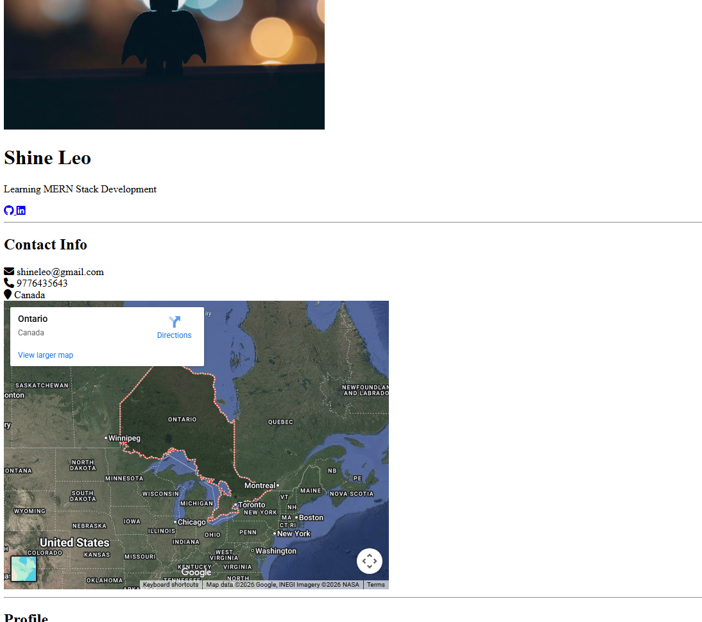
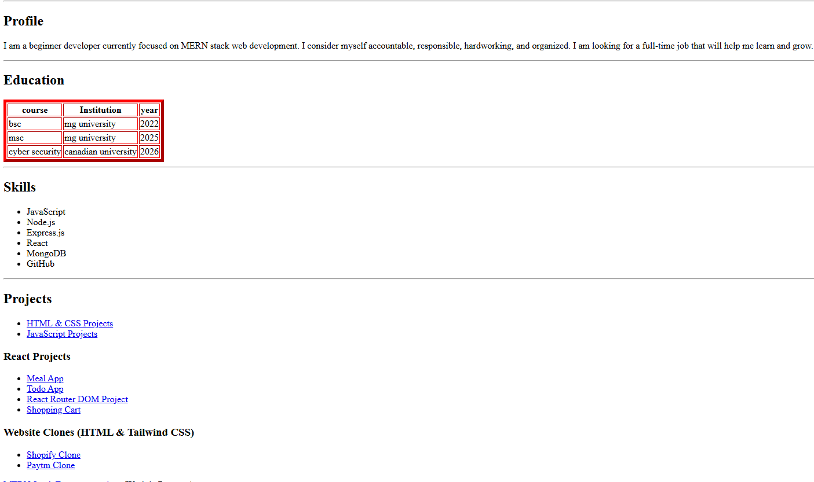

#  Professional Portfolio Website

> A clean and structured personal portfolio built using HTML5 to showcase my profile, skills, education, and development projects.

---

## 📌 Overview

This project is a fully structured static portfolio website developed using core HTML.
It demonstrates my understanding of semantic HTML, layout structuring, external integrations, and content organization.

The portfolio serves as the foundation of my journey toward becoming a **Full-Stack MERN Developer**.

---

## ✨ Key Highlights

* Structured semantic HTML5 layout
* Responsive meta viewport configuration
* Integration of external icon library (Font Awesome)
* Embedded interactive Google Map
* Organized education and skills sections
* Clean project categorization
* Beginner-friendly yet professionally structured codebase

---

## 🛠 Tech Stack

| Technology        | Purpose              |
| ----------------- | -------------------- |
| HTML5             | Structure and layout |
| Font Awesome CDN  | Icons                |
| Google Maps Embed | Location display     |

---
## Preview





## 📂 Project Structure

```
portfolio/
│
├── index.html
└── README.md
```

---

## 📑 Website Sections

### 👤 Introduction

* Profile image
* Name and role description

### 📞 Contact Information

* Email
* Phone
* Location
* Embedded map

### 🎓 Education

* BSc – 2022
* MSc – 2025
* Cyber Security – 2026

### 💻 Skills

* JavaScript
* Node.js
* Express.js
* React
* MongoDB
* GitHub

### 🚀 Projects

* HTML & CSS Projects
* JavaScript Projects
* React Projects
* Website Clones
* MERN Stack E-commerce App *(In Progress)*

---

## 🧠 Learning Outcomes

Through this project, I strengthened my understanding of:

* HTML document structure
* Semantic elements
* Tables and lists
* Embedding third-party content
* Using CDNs
* Organizing clean markup
* Building foundational portfolio layout

---

## 🚀 Getting Started

### 1️⃣ Clone the Repository

```bash
git clone https://github.com/your-username/your-repository-name.git
```

### 2️⃣ Open the Project

```bash
cd your-repository-name
```

### 3️⃣ Run the Project

Open `index.html` in your browser.

---

## 🔮 Future Enhancements

* Add CSS styling and responsive design
* Implement modern UI/UX layout
* Add animation effects
* Deploy via Netlify or Vercel
* Integrate backend contact form (MERN)
* Add downloadable resume
* Convert into full-stack dynamic portfolio

---

## 📈 Roadmap

* [x] Build basic HTML portfolio
* [ ] Add CSS styling
* [ ] Make fully responsive
* [ ] Deploy live
* [ ] Upgrade to MERN stack portfolio

---

## 👨‍💻 Author

**Abhinav ABIN**
Aspiring web Developer
Focused on building scalable and user-friendly web applications.

---

## 📄 License

This project is open-source and available for learning and personal use.

